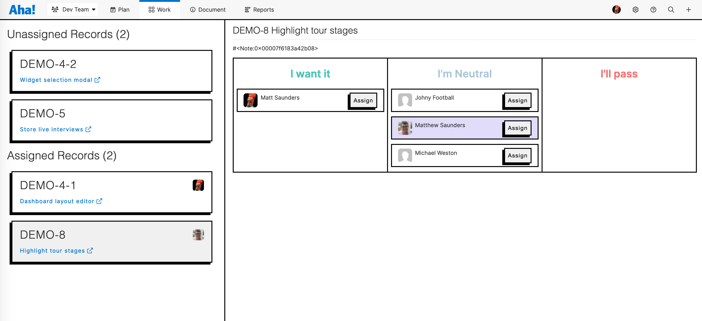
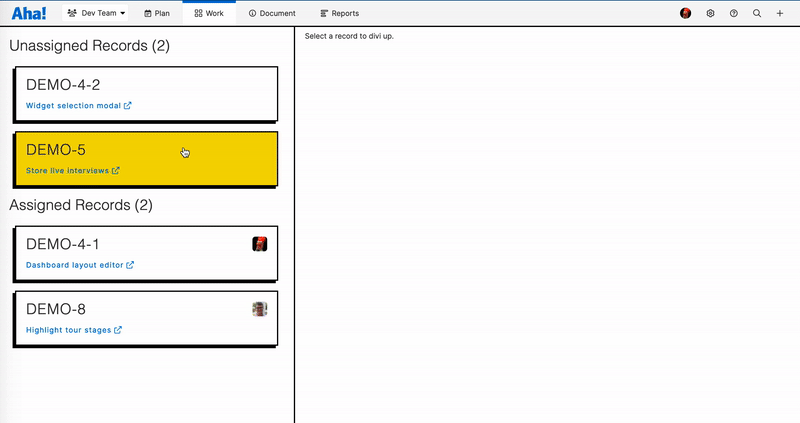

# divi-it-up

This [Aha! Develop](https://www.aha.io/develop/overview) extension provides an interactive way for a team to divide up for the work from current iteration amongst its team members.

---

## Usage

The extension is broken into two components...

### 1. DiviItUp Voting

To enable DiviItUp Voting, an account administrator will need to create a custom layout for your Feature and Requirement records including the extension field named `DiviItUp Voting`.  Once that field is added to the active lyout, all users in the account using this extension will see this field.


That field is for users to weigh in on a record / unit of work with whether or not they want to take it.  They can answer with one of the following:
  * I'll take it
  * I'm neutral
  * I'll pass

The workflow for this extension is to have team members review and weigh in on a record before planning the next iteration.  That way, at the iteration planning meeting, their feedback on a record is already known and assigning work is quick and easy using the DiviItUp Board.

### 2. DiviItUp Board



The DiviItUp Board shows a list of assigned and unassigned records from the current iteration in the left column.  When a user, typically a team lead, selects a record, the details of that record populate in the right panel showing the record details and how everyone in your team voted for this record.

_**Note: If someone did not vote for a record, they are defaulted to the __I'm Neutral__ column._

From here, the team lead can determine who should be assigned the work based on the team member's inputs and each member's workload for the iteration based on the already assigned records.  Once you determine who should be assigned the record, simply click the `Assign` button next to that user.

---

## Demo



## Installing the extension

**Note: In order to install an extension into your Aha! Develop account, you must be an account administrator.**

<!-- # TODO: Fill in a link to your built extension package
Install the divi-it-up extension by clicking [here](https://secure.aha.io/settings/account/extensions/install?url=). -->

## Working on the extension

Install `aha-cli`:

```sh
 npm install -g aha-cli
```

Clone the repo:

```sh
git clone https://github.com/msaun008/diviitup.git
```

**Note: In order to install an extension into your Aha! Develop account, you must be an account administrator.**

Install the extension into Aha! and set up a watcher:

```sh
aha extension:install
aha extension:watch
```

Now, any change you make inside your working copy will automatically take effect in your Aha! account.

When you are finished working on your extension, build it so that others can install it through its URL:

```sh
aha extension:build
```

To learn more about developing Aha! Develop extensions, including the API reference, the full documentation is located here: [Aha! Develop Extension API]()
